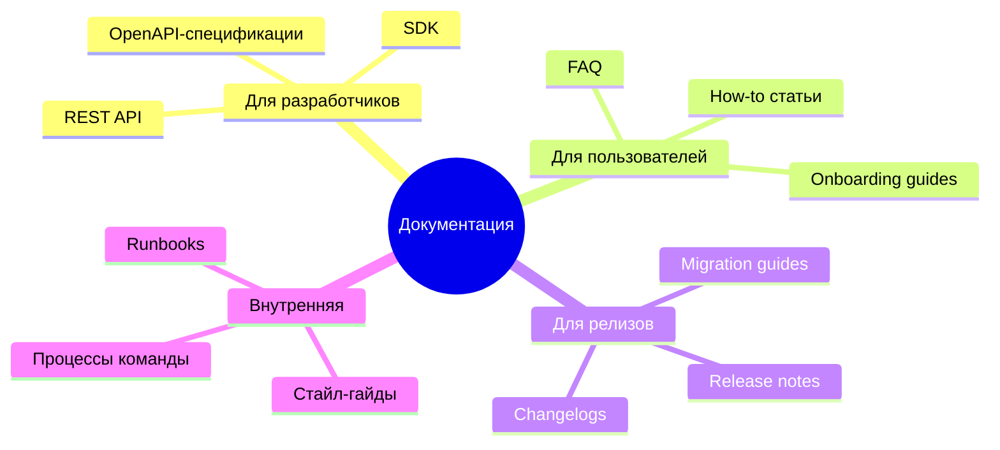

# Портфолио

Здесь собраны примеры моей документации. Все работы -- реальные фрагменты из рабочих проектов с изменёнными названиями продуктов и компаний.

:::note О примерах

Я показываю не весь документ, а репрезентативный фрагмент -- достаточный, чтобы оценить структуру, стиль и подход к аудитории.

:::

---

## Что я умею документировать

---

## Примеры работ

### 📘 REST API -- Руководство разработчика

**Продукт:** PayFlow (платёжный API) · **Аудитория:** Backend-разработчики

Документация платёжного REST API: endpoints, параметры, примеры запросов на трёх языках, коды ошибок.

**Что показывает этот пример:**

-  Структура API-документации по стандарту OpenAPI
-  Примеры кода с синтаксической подсветкой
-  Таблицы параметров с типами и обязательностью
-  Описание ошибок, которое реально помогает отлаживать

[Открыть пример →](./rest-api-guide)

---

### 📗 Руководство пользователя -- Onboarding

**Продукт:** TaskBoard (таск-менеджер) · **Аудитория:** Новые пользователи, нетехническая

Пошаговое руководство по первому запуску: вход, настройка профиля, создание проекта, приглашение команды.

**Что показывает этот пример:**

-  Структура задачно-ориентированной документации
-  Примечания и предупреждения в нужных местах
-  Язык, понятный нетехническому читателю

[Открыть пример →](./onboarding-guide)

---

### 📙 Release Notes -- v2.0

**Продукт:** TaskBoard · **Аудитория:** Пользователи и разработчики-интеграторы

Заметки о выпуске major-версии: breaking changes, новые функции, исправленные ошибки, инструкция по обновлению.

**Что показывает этот пример:**

-  Чёткое выделение breaking changes
-  Перевод технического changelog на язык пользователя
-  Структура по типам изменений

[Открыть пример →](./v2-release-notes)

---

## Подход к работе

:::quote 

Я не просто пишу текст -- я проектирую информацию. Структура, навигация, порядок подачи материала важны не меньше самих слов.

:::