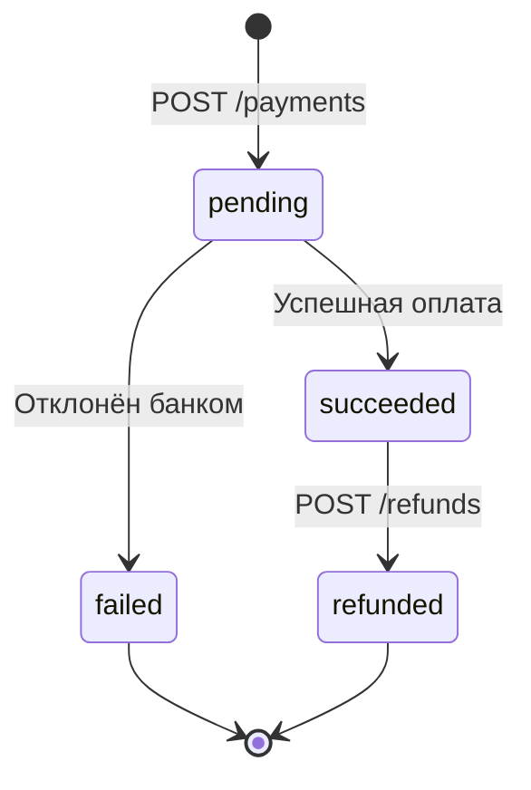

PayFlow API позволяет принимать платежи, управлять возвратами и отслеживать транзакции. API построен по принципам REST и возвращает ответы в формате JSON.

Base URL:

```
https://api.payflow.example.com/v1
```

:::note Тестовая среда

Для разработки используйте `https://sandbox.payflow.example.com/v1`. Тестовые ключи начинаются с `sk_test_`.

:::

## Аутентификация

Все запросы требуют API-ключ в заголовке:

```http
Authorization: Bearer YOUR_API_KEY
```

:::note Безопасность ключей

Никогда не передавайте API-ключ в URL-параметрах и не храните его в клиентском коде. Используйте переменные окружения или секрет-менеджеры.

:::

## Создать платёж

```
POST /payments
```

### Параметры запроса

| Поле          | Тип     | Обязательное | Описание                           |
|---------------|---------|--------------|------------------------------------|
| `amount`      | integer | ✅            | Сумма в центах: `1000` = 10.00 EUR |
| `currency`    | string  | ✅            | Код валюты по ISO 4217             |
| `description` | string  | ❌            | Описание платежа, до 255 символов  |
| `metadata`    | object  | ❌            | Произвольные данные ключ–значение  |

### Примеры запросов

#### cURL

```bash
curl -X POST https://api.payflow.example.com/v1/payments \
  -H "Authorization: Bearer sk_test_abc123" \
  -H "Content-Type: application/json" \
  -d '{
    "amount": 2500,
    "currency": "EUR",
    "description": "Подписка Pro на 1 месяц"
  }'
```

#### Python

```python
import requests

response = requests.post(
    "https://api.payflow.example.com/v1/payments",
    headers={"Authorization": "Bearer sk_test_abc123"},
    json={
        "amount": 2500,
        "currency": "EUR",
        "description": "Подписка Pro на 1 месяц"
    }
)

payment = response.json()
print(payment["id"])  # pay_9fGk2mNpQr
```

#### JavaScript

```javascript
const response = await fetch("https://api.payflow.example.com/v1/payments", {
  method: "POST",
  headers: {
    "Authorization": "Bearer sk_test_abc123",
    "Content-Type": "application/json"
  },
  body: JSON.stringify({
    amount: 2500,
    currency: "EUR",
    description: "Подписка Pro на 1 месяц"
  })
});

const payment = await response.json();
console.log(payment.id); // pay_9fGk2mNpQr
```

### Ответ `200 OK`

```json
{
  "id": "pay_9fGk2mNpQr",
  "status": "pending",
  "amount": 2500,
  "currency": "EUR",
  "description": "Подписка Pro на 1 месяц",
  "created_at": "2024-03-15T10:30:00Z"
}
```

## Статусы платежей



| Статус      | Описание                  |
|-------------|---------------------------|
| `pending`   | Создан, ожидает обработки |
| `succeeded` | Успешно завершён          |
| `failed`    | Отклонён                  |
| `refunded`  | Средства возвращены       |

## Коды ошибок

| HTTP-код | Код ошибки       | Что делать                             |
|----------|------------------|----------------------------------------|
| `400`    | `invalid_amount` | Проверьте тип и значение поля `amount` |
| `401`    | `unauthorized`   | Проверьте API-ключ                     |
| `404`    | `not_found`      | Проверьте `payment_id`                 |
| `429`    | `rate_limit`     | Подождите 60 секунд и повторите        |
| `500`    | `server_error`   | Обратитесь в поддержку                 |

Формат ответа с ошибкой:

```json
{
  "error": {
    "code": "invalid_amount",
    "message": "Amount must be a positive integer"
  }
}
```

## Лимиты и ограничения

:::info Лимиты запросов

-  100 запросов в минуту на один API-ключ.

-  Минимальная сумма платежа: 50 центов.

-  Максимальная сумма: 999 999 EUR.

При превышении лимита API вернёт `429 Too Many Requests`.

:::