<note type="lab" title="Полезные ссылки">

-  Вся работа на мастер-классе проводится тут: <https://app.gram.ax>

-  Пример сайт-визитки

   -  Для просмотра: <https://kpavlovaa.cloud.gram.ax/portfolio-example/resume>

   -  Для копирования: [https://app.gram.ax/github.com/KaterinPavlova/portfolio-example/master/-](https://app.gram.ax/github.com/KaterinPavlova/portfolio-example/master/-)

-  Репозиторий с сайтом-визиткой: <https://github.com/KaterinPavlova/portfolio-example>

</note>

На мастер-классе вместе сделаем сайт-визитку в Gramax. Если отстали -- смотрите «Инструкция». Если что-то не работает -- «Траблшутинг».

## Инструкция

### **Создать каталог**

1. Откройте <https://app.gram.ax> и нажмите «Создать каталог».

2. Задайте название статьи и напишите любой текст.

### **Задать красивые урлы**

1. Рядом со значком поиска нажмите троеточие и выберите «Настроить каталог».

   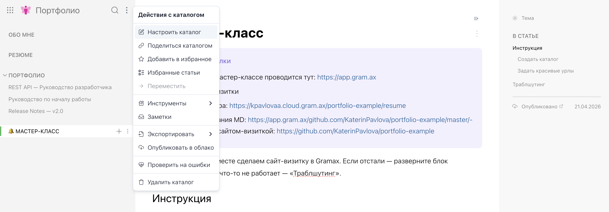{width=2880px height=1006px}

2. Задайте название репозитория -- **оно отобразится в URL**. Также задайте название каталога и настройте внешний вид.

   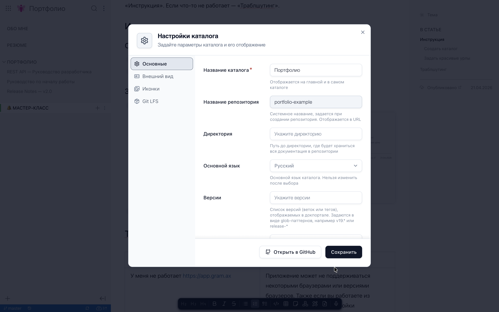{width=2880px height=1800px}

3. Рядом с названиями статей также кликните троеточие, а затем -- «Настроить».

   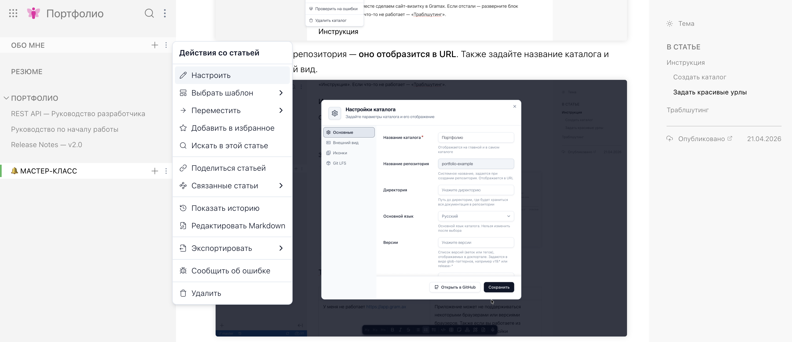{width=2880px height=1246px}

4. Укажите URL.

   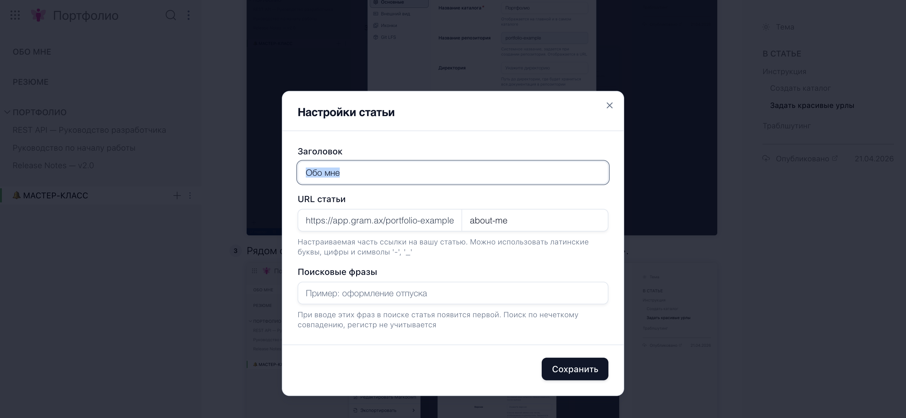{width=2880px height=1332px}

### Опубликовать всем в интернете

1. Кликните {width=72px height=62px} в левом верхнем углу. В блоке «Экспериментальные функции» включите «Облако».

   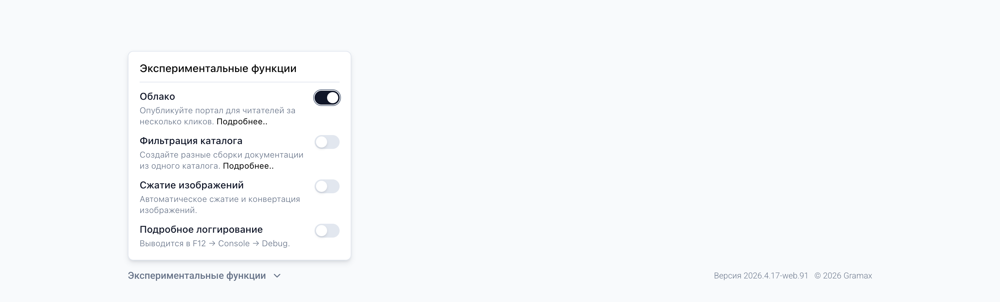{width=2880px height=872px}

2. Откройте каталог и кликните троеточие рядом со значком поиска. Выберите «Опубликовать в облако»

   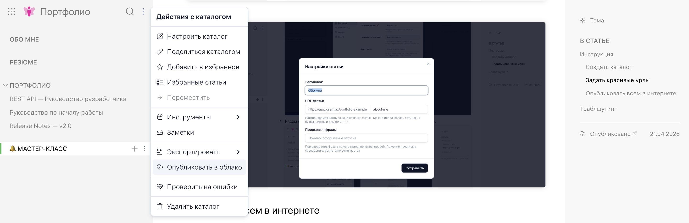{width=2880px height=934px}

3. Подключите Google-аккаунт и опубликуйте сайт.

### Внести правки и опубликовать их

В правой панели кликните троеточие рядом со статусом «Опубликовано» и выберите «Перепубликовать». Без этого сайт автоматически меняться не будет.

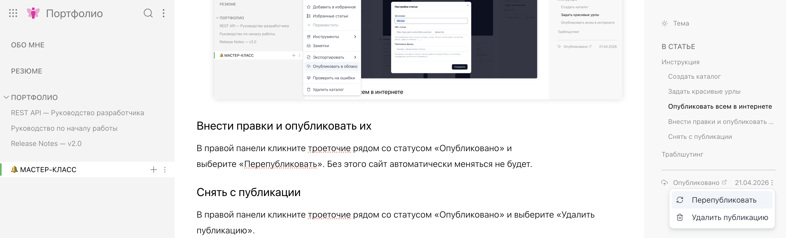{width=2880px height=874px}

### Снять с публикации

В правой панели кликните троеточие рядом со статусом «Опубликовано» и выберите «Удалить публикацию».

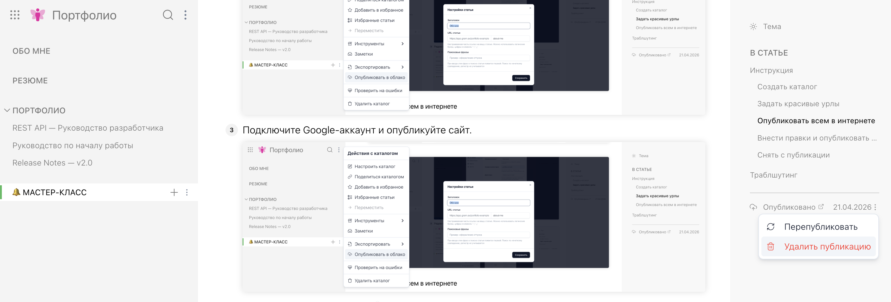{width=2880px height=978px}

### Создать бэкап

Ваш каталог хранится локально в кэше браузера. Это означает, что с другого компьютера или из другого браузера вы не сможете его отредактировать. Также он может исчезнуть, если вы почистите кэш браузера. Для удобства работы (по классическому Docs as Code) нужно создать для каталога репозиторий в Git-хранилище.

1. В левой синей панели кликните значок облачка.

2. Подключите Git-хранилище. Я рекомендую создать аккаунт в GitHub:)

3. Опубликуйте репозиторий.

После этого любые изменения в каталоге также будет необходимо публиковать в Git-хранилище. Для этого снова кликаем облачко, а затем -- «Опубликовать».

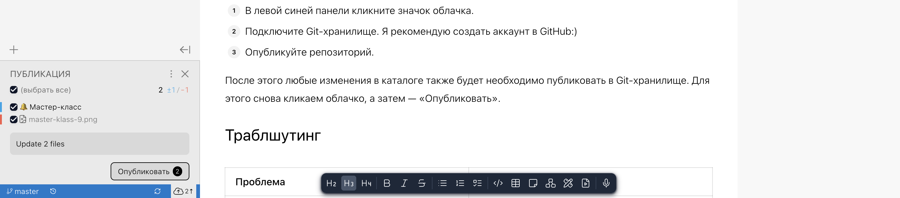{width=2880px height=638px}

## Траблшутинг

<table header="row">
<tr>
<td>

Проблема

</td>
<td>

Решение

</td>
</tr>
<tr>
<td>

У меня не работает <https://app.gram.ax>

</td>
<td>

Приложение может не поддерживаться некоторыми браузерами или версиями браузеров. Также если вы работаете из корпоративной сети -- настройки безопасности вашей компании могут блокировать подключение

-  Если работаете из корпоративной сети -- попробуйте отключить VPN. Или откройте приложение с личного компьютера

-  Попробуйте в другом браузере

-  Проверьте расширения браузера: если есть блокировщики рекламы или что-то такое -- отключите

</td>
</tr>
<tr>
<td>

<https://app.gram.ax> долго грузится

</td>
<td>

Приложение работает локально в вашем браузере. При самом первом входе ему нужно загрузиться в кэш

-  Просто подождите:)

-  Попробуйте перезагрузить страничку

</td>
</tr>
<tr>
<td>

Все на английском

</td>
<td>

Кликните {width=72px height=62px} в левом верхнем углу. На главной нажмите 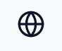{width=88px height=72px} и выберите «Русский»

</td>
</tr>
<tr>
<td>

Нет кнопки «Опубликовать в облако»

</td>
<td>

Откройте главную и включите функцию «Облако»

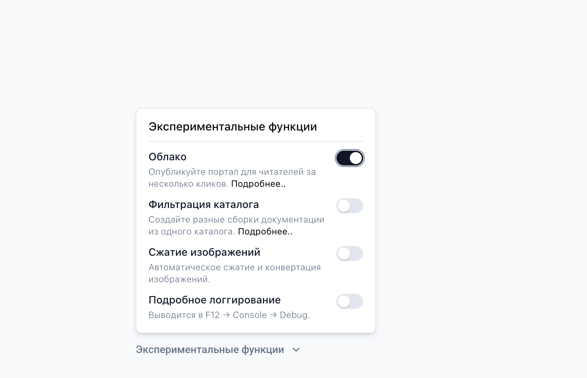{width=1574px height=1014px}

</td>
</tr>
<tr>
<td>

Падает ошибка «Что-то пошло не так»

</td>
<td>

Перезагрузите страничку

</td>
</tr>
</table>
